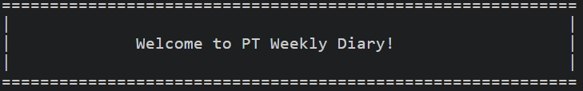
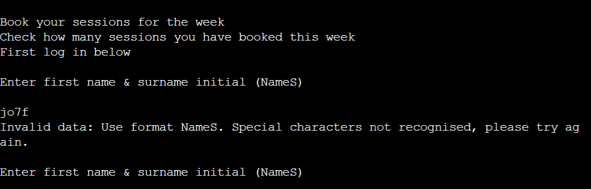
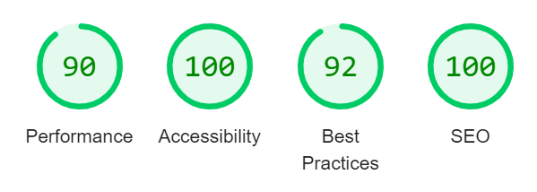

# **PT Weekly Diary**

This is a terminal based app for a fictional PT business. The app will allow users to make a booking for that week. Data for the bookings and current clients are held on an external Google Worksheet. 

Access the site here: [PT Weekly Diary](https://pt-schedule.herokuapp.com/)

## **How to use**
Users are provided with set options from app startup. First, the user must enter a username in the stated format, which is compared to client list on an external sheet. The user has a choice to make a new booking or check pre-existing bookings for the week. If new booking is selected, the user is prompted to select a day, followed by a time from the printed available timeslots. The external sheet is then updated with the username and booking time/date chosen.

---

## **Goals/Expectations**
1. Provide clear insrtuctions to make and check bookings
2. Ensure user inputted data is in the correct format for functions
3. Give visual feedback for user interaction
4. Provide accurate summary of requested data from external spreadsheet

### **User Stories**
1. As a user, I would like create a profile
2. As a user, I would like to select a day to book
3. As a user, I would like to select a timeslot to book
4. As a user, I would like to check how many bookings I have for the week
---

## **Design**
The website uses a colour pallette generated by [Coolors](#references). This gives a simplistic yet clean appearence to the app. The backgroung image is related to the subject matter with images surrounding the terminal. The app content has been centralised to make the terminal the focal point of the viewport.
An external Google Worksheet containing ficticious data was created. The worksheet consists of two sheets. One contains a client list. The other contains a weekly calender, with days of the week as columns, and timeslots as rows. You can view worksheet here: [Worksheet](https://docs.google.com/spreadsheets/d/14Fix_---TsvLw9N05QEzqSLKVtYVEMS6iktBybBdPdc/edit?usp=sharing)
The purpose of the app is to access the data contained within the worksheet in order to update it based on user interaction, as well as read and interpret the data following user input/requests.
The logic for the app functions were planned using a logic map. You can find the logic map for the original concept here: [logic](assets/images/logic-map.png)

## Future Updates

* Background image to be hosted locally and visible
* A more in depth menu function for better user interaction and experience
* Addtional information in worksheet such as fitness goals
* Function to manipulate new information on weeksheet

---

## **Features**

### **Header**

The header is large and central above the terminal to display the app name. A basic colour of black has been utilised to provide contrast to the background image. A slightly translucent background around the header has been placed for contrast from the background image for smaller screen loads. Imported font called Aoboshi One used.

### **Button**

The button is central above the terminal in a bright colour, with black text. On hover the background and text change to more muted colours to signify user interaction.

### **Terminal**

The terminal has been placed in the center of the page, to make it the main focal point against the background image.

### **Name banner**

A simple app name banner has been made to print on app load. This is for consistent branding of the fake business

### **Insturctions**

General app purpose is printed under banner on load. Several instructions are printed throughout the app with tailored error messages for user input. This is to ensure expectations of the site are met. The instructions also act as a clear guide to enhance UX and overall functionality of app

---
## **Testing**

The site has been tested on a variety of devices and browsers to check the functionality and general layout. This app is not suitable for smaller devices. Tested devices include the following:

* Laptop on Google Chrome and Microsoft Edge browsers
* Apple laptop on Google Chrome

| Test  | Result | As expected | Fixes|
| :-------------: | :-------------: | :-------------: | :-------------: |
| Username validation. Use special characters or numbers  | Value error raised  | Yes | None |
| New user. Enter name not on client list | Username added to external 'client' sheet | Yes | None
| Client check. Use existing username to see if matched to sheet  | Name found and welcome message printed  | Yes | None
| Client check. Use key other than y or n |  Value error raised | Yes | None
| New booking. Use numeric key not on day select | Value error raised | Yes | None
| Timeslots. Use numeric key not in available slots | Value error raised | Yes | None
| Update booking. Select day and timeslot | Username added to correct cell on 'booking sheet' | Yes | None
| Check booking. Use key other than y or n | Value error raised | Yes | None
| Menu choice. Use int not in options | Terminal froze | No. Expected error message and exit | Incorrect indentation on error message. Corrected.

The deployed site was shared amongst family and friends to obtain user experience feedback. Overall the feedback was positive. They were able to follow on app instructions to create a profile and booking successfully.

---
## **Bugs**
* Background image would not load with local file path. Linked to external hosted site via url instead to make it display. Increased load time as a result but image now present.

---
## **Validator Testing**
* HTML - Official W3C validator used.

* Pep8 Linter - CI Python Linter used. No errors found

* Accessibility - Lighthouse checks were conducted on the site, returning 90+ on areas

---
## **Technologies**

* HTML - Core structure of the site
* Javascript - Functionality and responsiveness of user initiated interactions
* Heroku - Hosts the live site
* Github - Stores the site code and logged versions
* Codeanywhere - Cloud IDE used to write/design the site

## **Libraries**

* Gspread
* Numpy
* Google sheets API

---
## **Deployment**
The project was deployed to Heroku. The steps below explain the process.

 - In the Settings tab of the named app, connect it to relevent Github repository
 - Scroll down to 'Buildpacks' and add python. Add a second buildpack for nodejs
 - Scroll up and click on the Deploy tab
 - There are 2 options for deployment, auto or manual. Ensure main is selected for deploy branch.
 - Click Enable Automatic deploys if you want the app to update after every push to Github
 - For manual deployment click 'Deploy Branch'. This will have to be done after every push to Github to update the live app.

Forking the GitHub Repository makes a copy of the original repository on the GitHub account to view and/or make changes without affecting the original repository. The steps below explain the process

 - Log in to GitHub and locate the GitHub Repository
 - At the top of the Repository just above the "Settings" button on the menu, locate the "Fork" button
 - You should now have a copy of the original repository in your GitHub account

Use the below steps to make a Local Clone

 - Log in to GitHub and locate the GitHub Repository
 - Under the repository name, click "Clone or download"
 - To clone the repository using HTTPS, under "Clone with HTTPS", copy the link
 - Open Git Bash
 - Change the current working directory to the location where you want the cloned directory to be made
 - Type git clone, and then paste the URL you copied in Step 3
 - Press Enter. Your local clone will be created

---
## **References**
1. [Code Institute](https://github.com/Code-Institute-Solutions/love-sandwiches-p5-sourcecode) - Template for base structure. Course requirement to use.
2. [Visual Paradigm](https://online.visual-paradigm.com/)- Logic map editor
3. [Lukas via Pexels](https://www.pexels.com/photo/barbells-on-gray-surface-669584/) - Background image
4. [Favicon](https://favicon.io/emoji-favicons/calendar/) - icon
5. [Google Fonts](https://fonts.google.com/) - imported font
6. [Coolors](https://coolors.co/bbd8b3-f3b61f-a29f15-510d0a-191102) - Colour Scheme Generator
7. [Alexa H's Github](https://github.com/AlexaH88/harry-potter-adventure-game) - Harry Potter Game - Styling for central position of terminal, button, and header used from this repo
8. [Google Docs](http://google.com) - Google sheets for worksheet creation and hosting
9. [Am I Responsive](https://ui.dev/amiresponsive) - Generated screen mockups
10. [Stack Overflow](https://stackoverflow.com/questions/19309275/how-to-capitalize-first-and-last-letters-of-each-word-in-a-python-string) - Negative indexing solution to username format